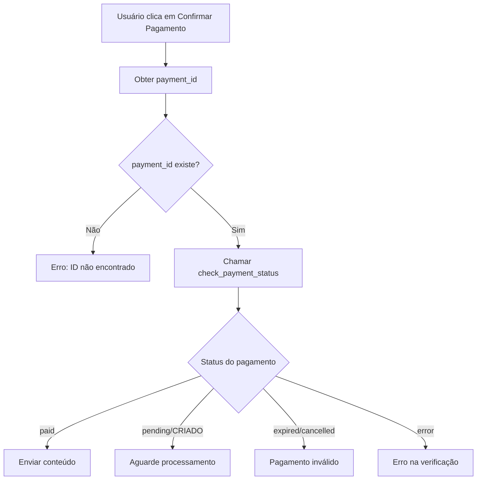
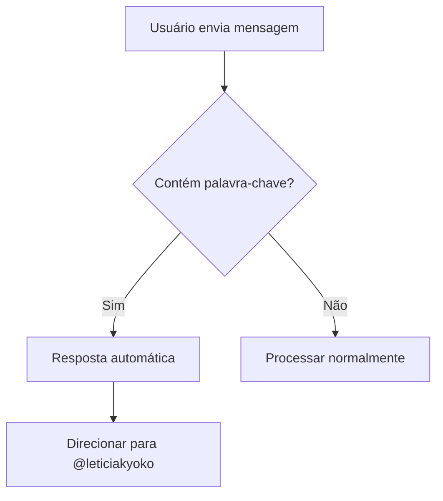

# 🔧 Correção da Verificação de Pagamento

## 📋 Resumo

Este documento descreve as correções implementadas para resolver o problema onde o botão "Confirmar Pagamento" não funcionava adequadamente, incluindo melhorias na verificação de status da PUSHIN PAY e adição de handlers para mensagens de confirmação de pagamento.

## 🐛 Problemas Identificados

### 1. Verificação de Pagamento Inadequada
- **Problema**: A função `check_payment_status` retornava apenas `True/False`
- **Impacto**: Não diferenciava entre "não pago" e "aguardando processamento"
- **Status ignorados**: `CRIADO`, `pending`, `expired`, `cancelled`

### 2. Ausência de Handler para Mensagens de Pagamento
- **Problema**: Usuários enviando "Paguei" ou "Já fiz o pix" não recebiam resposta
- **Impacto**: Experiência do usuário prejudicada
- **Necessidade**: Direcionamento para contato manual

## ✅ Soluções Implementadas

### 1. Melhoria da Função `check_payment_status`

#### Antes:
```python
def check_payment_status(payment_id: str) -> bool:
    # Retornava apenas True/False
    return payment_data.get('status') == 'paid'
```

#### Depois:
```python
def check_payment_status(payment_id: str) -> dict:
    # Retorna informações detalhadas
    return {
        'paid': status == 'paid',
        'status': status,
        'data': payment_data
    }
```

#### Benefícios:
- **Status detalhado**: Diferencia entre estados de pagamento
- **Melhor debugging**: Logs mais informativos
- **Flexibilidade**: Permite diferentes ações baseadas no status

### 2. Verificação Aprimorada nos Botões

#### Lógica Implementada:
```python
if payment_status['paid']:
    await send_content_link(query, context)
else:
    status = payment_status['status']
    if status == 'pending' or status == 'CRIADO':
        await query.answer("Pagamento ainda não foi processado. Aguarde alguns minutos e tente novamente.", show_alert=True)
    else:
        await query.answer("Você ainda não pagou amor, verifica aí e tenta de novo.", show_alert=True)
```

#### Estados Tratados:
- **`paid`**: Pagamento confirmado → Enviar conteúdo
- **`pending/CRIADO`**: Aguardando processamento → Mensagem de espera
- **`expired/cancelled`**: Pagamento inválido → Solicitar novo pagamento
- **`error`**: Erro na API → Mensagem de erro

### 3. Handler para Mensagens de Pagamento

#### Palavras-chave Detectadas:
- "paguei"
- "já fiz o pix" / "ja fiz o pix"
- "fiz o pix"
- "pagamento feito"
- "pix feito"

#### Resposta Automática:
```
"Se você já fez o pix me manda o comprovante em @leticiakyoko porfavorzinho, vou te mandar o pack assim que conseguir <3"
```

#### Implementação:
```python
payment_keywords = ['paguei', 'já fiz o pix', 'ja fiz o pix', 'fiz o pix', 'pagamento feito', 'pix feito']
if any(keyword in message_text for keyword in payment_keywords):
    await update.message.reply_text(
        "Se você já fez o pix me manda o comprovante em @leticiakyoko porfavorzinho, vou te mandar o pack assim que conseguir <3"
    )
    return
```

## 🔄 Fluxo de Verificação Atualizado

### 1. Usuário Clica em "Confirmar Pagamento"


### 2. Usuário Envia Mensagem de Pagamento


## 📊 Status de Pagamento da PUSHIN PAY

| Status | Descrição | Ação do Bot |
|--------|-----------|-------------|
| `paid` | Pagamento confirmado | ✅ Enviar conteúdo |
| `pending` | Aguardando processamento | ⏳ Solicitar espera |
| `CRIADO` | Pagamento criado | ⏳ Solicitar espera |
| `expired` | Pagamento expirado | ❌ Solicitar novo pagamento |
| `cancelled` | Pagamento cancelado | ❌ Solicitar novo pagamento |
| `error` | Erro na consulta | ⚠️ Mensagem de erro |

## 🧪 Testes Recomendados

### 1. Teste de Verificação de Pagamento
```bash
# Cenários a testar:
1. Pagamento recém-criado (status: CRIADO)
2. Pagamento processando (status: pending)
3. Pagamento confirmado (status: paid)
4. Pagamento expirado (status: expired)
5. ID de pagamento inválido
```

### 2. Teste de Mensagens de Pagamento
```bash
# Mensagens a testar:
1. "Paguei"
2. "Já fiz o pix"
3. "Fiz o pagamento"
4. "Pix feito"
5. Mensagens mistas: "Oi, já paguei o pix"
```

## 🔍 Monitoramento e Logs

### Logs Importantes:
```python
# Verificação de pagamento
logger.info(f'Verificação de pagamento: {response.status_code} - {response.text}')

# Detecção de mensagens de pagamento
logger.info(f'Mensagem de pagamento detectada: {message_text}')

# Status detalhado
logger.info(f'Status do pagamento {payment_id}: {status}')
```

### Métricas a Acompanhar:
- Taxa de sucesso na verificação de pagamentos
- Frequência de mensagens "Paguei"
- Tempo entre criação e confirmação de pagamento
- Erros de API da PUSHIN PAY

## 🚀 Próximos Passos

### Melhorias Futuras:
1. **Webhook da PUSHIN PAY**: Receber notificações automáticas
2. **Retry automático**: Tentar verificar pagamento periodicamente
3. **Cache de status**: Evitar consultas desnecessárias à API
4. **Notificações proativas**: Avisar quando pagamento for confirmado

### Configuração de Webhook (Opcional):
```python
# No create_pix_payment:
payload = {
    'value': value_in_cents,
    'webhook_url': 'https://seu-bot.railway.app/webhook/pushin-pay'
}
```

## 📞 Suporte

Para problemas relacionados a pagamentos:
- **Contato manual**: @leticiakyoko
- **Logs do sistema**: Verificar Railway logs
- **API PUSHIN PAY**: Consultar documentação oficial

## 📝 Changelog

### v1.2.0 - Correção de Verificação de Pagamento
- ✅ Função `check_payment_status` retorna status detalhado
- ✅ Verificação específica para status `CRIADO` e `pending`
- ✅ Handler para mensagens de confirmação de pagamento
- ✅ Melhor feedback ao usuário sobre status
- ✅ Direcionamento automático para @leticiakyoko
- ✅ Logs mais informativos
- ✅ Tratamento de erros aprimorado