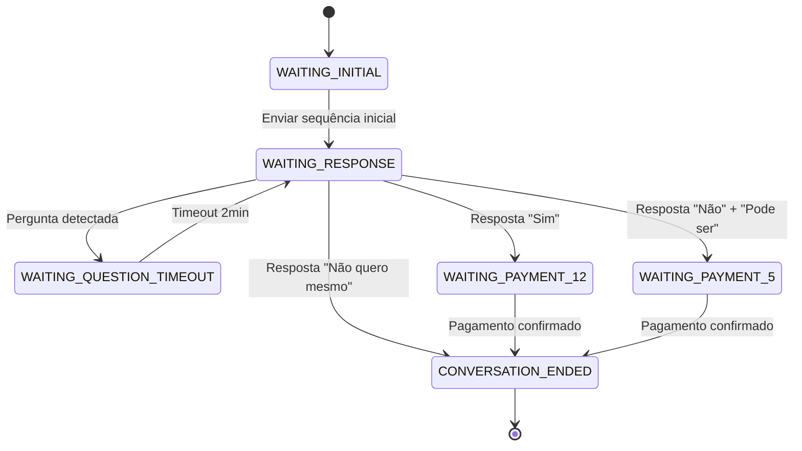

# 📚 Documentação Técnica - Bot Kyoko

## 🎯 Overview Geral

### Para Leigos

O **Bot Kyoko** é um assistente virtual automatizado que funciona no aplicativo Telegram. Ele simula uma conversa de vendas de "packs" (coleções de fotos e vídeos) de forma completamente automática.

**Como funciona na prática:**
1. Uma pessoa envia uma mensagem para o bot
2. O bot responde automaticamente com uma sequência de mensagens
3. Mostra fotos e vídeos de exemplo
4. Oferece um "pack" por R$ 12,90
5. Se a pessoa recusar, oferece desconto para R$ 5,00
6. Gera um código PIX automaticamente para pagamento
7. Após o pagamento, envia um link para download do conteúdo

**Vantagens:**
- ✅ Funciona 24 horas por dia, 7 dias por semana
- ✅ Não precisa de pessoa para responder
- ✅ Processa pagamentos automaticamente
- ✅ Conversa natural e convincente
- ✅ Sistema de desconto automático

### Para Desenvolvedores

Bot desenvolvido em Python usando a biblioteca `python-telegram-bot` com integração à API Pushin Pay para processamento de pagamentos PIX. Implementa máquina de estados para controle de fluxo conversacional e sistema de callbacks para interações via botões inline.

## 🔧 Arquitetura Técnica

### Tecnologias Utilizadas

| Tecnologia | Versão | Propósito |
|------------|--------|----------|
| Python | 3.9+ | Linguagem principal |
| python-telegram-bot | 20.7 | SDK Telegram Bot API |
| requests | 2.31.0 | Cliente HTTP para APIs |
| aiofiles | 23.2.1 | I/O assíncrono de arquivos |
| python-dotenv | 1.0.0 | Gerenciamento de variáveis de ambiente |

### Padrões de Arquitetura

- **State Machine Pattern**: Controle de estados da conversa
- **Observer Pattern**: Handlers para eventos do Telegram
- **Strategy Pattern**: Diferentes fluxos de pagamento
- **Factory Pattern**: Criação de mensagens e botões

## 🌐 Integração com APIs

### Telegram Bot API

**Base URL**: `https://api.telegram.org/bot{token}/`

#### Endpoints Utilizados

| Método | Endpoint | Propósito |
|--------|----------|----------|
| POST | `/sendMessage` | Enviar mensagens de texto |
| POST | `/sendPhoto` | Enviar imagens |
| POST | `/sendVideo` | Enviar vídeos |
| POST | `/sendAudio` | Enviar áudios |
| POST | `/editMessageText` | Editar mensagens existentes |
| POST | `/answerCallbackQuery` | Responder cliques em botões |
| GET | `/getMe` | Obter informações do bot |
| POST | `/setMyCommands` | Configurar comandos do bot |

#### Estrutura de Requisição

```json
{
  "chat_id": 123456789,
  "text": "Mensagem para o usuário",
  "reply_markup": {
    "inline_keyboard": [[
      {
        "text": "Botão",
        "callback_data": "acao_botao"
      }
    ]]
  }
}
```

#### Estrutura de Resposta

```json
{
  "ok": true,
  "result": {
    "message_id": 123,
    "from": {
      "id": 987654321,
      "is_bot": true,
      "first_name": "Kyoko uwu"
    },
    "chat": {
      "id": 123456789,
      "type": "private"
    },
    "date": 1642781234,
    "text": "Mensagem enviada"
  }
}
```

### Pushin Pay API

**Base URL**: `https://api.pushinpay.com.br/api/`

#### Autenticação

```http
Authorization: Bearer 39884|DKt79CdRINdHafadVS01KwEHsF6vi8GwAoW273Meea17b5d5
Content-Type: application/json
```

#### Endpoints

##### 1. Criar Pagamento PIX

**Endpoint**: `POST /pix/cashIn`

**Requisição**:
```json
{
  "value": 1290,
  "description": "Pack Kyoko - R$ 12,90"
}
```

**Resposta**:
```json
{
  "id": "pay_abc123",
  "value": 1290,
  "description": "Pack Kyoko - R$ 12,90",
  "status": "pending",
  "qr_code": "00020126580014BR.GOV.BCB.PIX...",
  "created_at": "2024-01-15T10:30:00Z",
  "expires_at": "2024-01-15T11:30:00Z"
}
```

##### 2. Verificar Status do Pagamento

**Endpoint**: `GET /transactions/{transaction_id}`

**Resposta**:
```json
{
  "id": "pay_abc123",
  "status": "paid",
  "paid_at": "2024-01-15T10:35:00Z",
  "value": 1290
}
```

#### Status de Pagamento

| Status | Descrição |
|--------|----------|
| `pending` | Aguardando pagamento |
| `paid` | Pagamento confirmado |
| `expired` | Pagamento expirado |
| `cancelled` | Pagamento cancelado |

## 🔄 Fluxo de Estados

### Máquina de Estados



### Estados Detalhados

#### `WAITING_INITIAL`
- **Trigger**: Primeira mensagem do usuário
- **Ação**: Enviar sequência de mensagens iniciais
- **Próximo Estado**: `WAITING_RESPONSE`

#### `WAITING_RESPONSE`
- **Trigger**: Aguardando resposta do usuário
- **Ações Possíveis**:
  - Detectar pergunta → `WAITING_QUESTION_TIMEOUT`
  - Resposta positiva → `WAITING_PAYMENT_12`
  - Resposta negativa → Oferecer desconto

#### `WAITING_QUESTION_TIMEOUT`
- **Trigger**: Pergunta detectada (contém "?")
- **Ação**: Aguardar 2 minutos
- **Próximo Estado**: `WAITING_RESPONSE` (com botões)

#### `WAITING_PAYMENT_12`
- **Trigger**: Usuário aceita oferta de R$ 12,90
- **Ação**: Gerar PIX e aguardar confirmação
- **Próximo Estado**: `CONVERSATION_ENDED`

#### `WAITING_PAYMENT_5`
- **Trigger**: Usuário aceita oferta de R$ 5,00
- **Ação**: Gerar PIX e aguardar confirmação
- **Próximo Estado**: `CONVERSATION_ENDED`

#### `CONVERSATION_ENDED`
- **Trigger**: Pagamento confirmado ou recusa final
- **Ação**: Enviar link ou despedida
- **Próximo Estado**: Reiniciar para nova conversa

## 📨 Sistema de Mensagens

### Tipos de Mensagem

#### 1. Mensagens de Texto
```python
await update.message.reply_text(
    text="Mensagem para o usuário",
    parse_mode=ParseMode.MARKDOWN
)
```

#### 2. Mensagens com Botões
```python
keyboard = [
    [InlineKeyboardButton("Sim", callback_data="sim")],
    [InlineKeyboardButton("Não", callback_data="nao")]
]
reply_markup = InlineKeyboardMarkup(keyboard)

await update.message.reply_text(
    text="Escolha uma opção:",
    reply_markup=reply_markup
)
```

#### 3. Envio de Mídia
```python
# Foto
with open('fotos/1.jpg', 'rb') as photo:
    await update.message.reply_photo(photo=photo)

# Vídeo
with open('fotos/1.mp4', 'rb') as video:
    await update.message.reply_video(video=video)

# Áudio
with open('fotos/audio.mp3', 'rb') as audio:
    await update.message.reply_audio(audio=audio)
```

### Sequência de Mensagens

1. **Saudação** (2s delay)
2. **Áudio placeholder** (2s delay)
3. **Foto 1** (2s delay)
4. **Foto 2** (2s delay)
5. **Vídeo 1** (3s delay)
6. **Descrição do pack** (2s delay)
7. **Oferta de preço**

## 🎮 Sistema de Callbacks

### Mapeamento de Callbacks

| Callback Data | Ação | Próximo Estado |
|---------------|------|---------------|
| `sim_12` | Gerar PIX R$ 12,90 | `WAITING_PAYMENT_12` |
| `nao_12` | Oferecer desconto | Manter estado |
| `pode_ser_5` | Gerar PIX R$ 5,00 | `WAITING_PAYMENT_5` |
| `nao_quero` | Finalizar conversa | `CONVERSATION_ENDED` |
| `confirm_payment_12` | Verificar pagamento R$ 12,90 | `CONVERSATION_ENDED` |
| `confirm_payment_5` | Verificar pagamento R$ 5,00 | `CONVERSATION_ENDED` |

### Processamento de Callbacks

```python
async def button_callback(update: Update, context: ContextTypes.DEFAULT_TYPE):
    query = update.callback_query
    await query.answer()  # Confirmar recebimento
    
    user_id = query.from_user.id
    data = query.data
    
    # Processar ação baseada no callback_data
    if data == "sim_12":
        # Lógica para gerar PIX
        pass
    elif data == "nao_12":
        # Lógica para oferecer desconto
        pass
    # ... outros callbacks
```

## 💾 Gerenciamento de Dados

### Armazenamento de Estado

```python
# Estados por usuário
user_states = {
    123456789: ConversationState.WAITING_RESPONSE,
    987654321: ConversationState.WAITING_PAYMENT_12
}

# Dados de contexto por usuário
context.user_data = {
    'payment_id_12': 'pay_abc123',
    'pix_code_12': '00020126580014BR.GOV.BCB.PIX...',
    'payment_id_5': 'pay_def456',
    'pix_code_5': '00020126580014BR.GOV.BCB.PIX...'
}
```

### Persistência

- **Estados**: Armazenados em memória (reiniciam com o bot)
- **Dados de pagamento**: Armazenados no contexto do usuário
- **Logs**: Salvos em arquivo via logging

## 🔒 Segurança e Boas Práticas

### Autenticação
- Token do bot armazenado em variável de ambiente
- Token da Pushin Pay configurado de forma segura
- Validação de origem das mensagens

### Validação de Dados
```python
# Verificar se é uma pergunta
if '?' in update.message.text:
    # Lógica para pergunta
    pass

# Validar resposta sim/não
if 'sim' in message_text.lower():
    # Lógica para resposta positiva
    pass
```

### Rate Limiting
- Delays entre mensagens para parecer natural
- Timeout de 2 minutos para perguntas
- Verificação de status de pagamento com intervalo

### Error Handling
```python
try:
    # Operação que pode falhar
    payment_data = create_pix_payment(12.90, "Pack Kyoko")
except Exception as e:
    logger.error(f'Erro ao criar pagamento: {e}')
    await update.message.reply_text(
        "Ops! Houve um erro. Tente novamente."
    )
```

## 📊 Monitoramento e Logs

### Configuração de Logging
```python
logging.basicConfig(
    format='%(asctime)s - %(name)s - %(levelname)s - %(message)s',
    level=logging.INFO
)
```

### Eventos Logados
- Início de conversas
- Mudanças de estado
- Criação de pagamentos
- Confirmação de pagamentos
- Erros de API
- Envio de mídias

### Métricas Importantes
- Taxa de conversão (mensagem → pagamento)
- Tempo médio de resposta
- Erros de API
- Volume de conversas por dia

## 🚀 Deploy e Produção

### Requisitos de Sistema
- Python 3.9+
- 512MB RAM mínimo
- 1GB espaço em disco
- Conexão estável com internet

### Variáveis de Ambiente
```bash
BOT_TOKEN=seu_token_aqui
PUSHIN_PAY_TOKEN=39884|DKt79CdRINdHafadVS01KwEHsF6vi8GwAoW273Meea17b5d5
CONTEUDO_LINK=https://kyokoleticia.site/conteudo
```

### Execução
```bash
# Desenvolvimento
python bot.py

# Produção (com nohup)
nohup python bot.py > bot.log 2>&1 &

# Com systemd (recomendado)
sudo systemctl start kyoko-bot
```

### Backup e Recuperação
- Backup dos arquivos de mídia
- Backup das configurações
- Monitoramento de uptime
- Restart automático em caso de falha

## 🔧 Manutenção

### Atualizações
1. Parar o bot
2. Fazer backup dos dados
3. Atualizar código
4. Testar em ambiente de desenvolvimento
5. Reiniciar em produção

### Troubleshooting
- Verificar logs de erro
- Testar conectividade com APIs
- Validar tokens de acesso
- Verificar permissões de arquivo

### Performance
- Monitorar uso de memória
- Otimizar envio de mídias
- Implementar cache se necessário
- Limitar número de conversas simultâneas